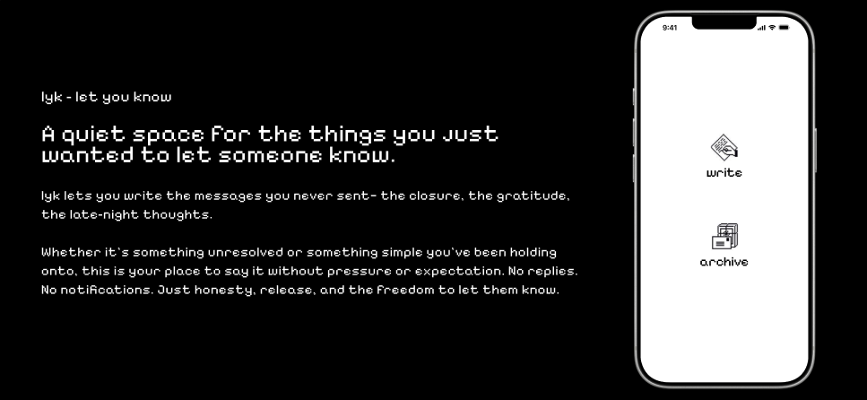
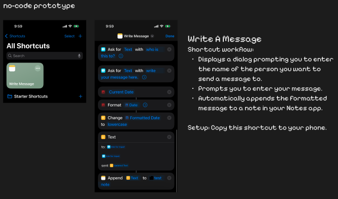
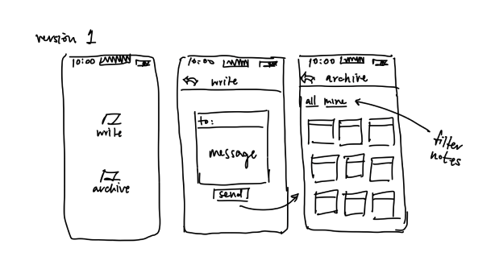
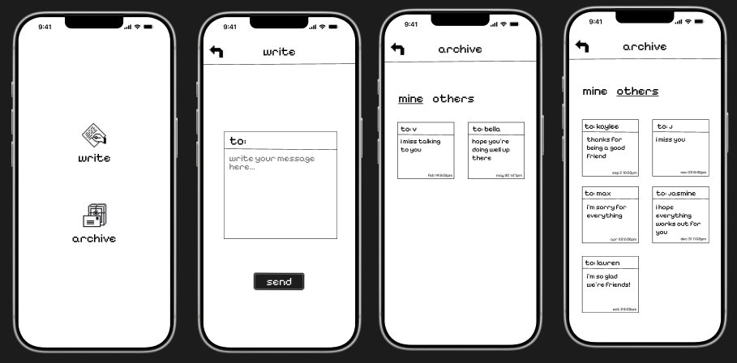

## About



## Demo
https://github.com/user-attachments/assets/3c7f05df-ad36-4050-9e24-5b299d0c1bcf

<!-- Process -->
## Process
1. No Code Prototypes

3. Low-fidelity wireframes

4. High-fidelity Figma designs


### Tech Stack

* [![React][React.js]][React-url]
* [![React Native][React Native]][ReactNative-url]
* [![Expo][Expo]][Expo-url]
* [![Node.js][Node.js]][Node-url]
* [![Express][Express.js]][Express-url]
* [![PostgreSQL][PostgreSQL]][PostgreSQL-url]

<!-- GETTING STARTED -->
## Getting Started

### Prerequisites

To explore, run, or contribute to this project, make sure you have the following installed:

### General Tools
- **Git** – for cloning the repository: [https://git-scm.com/](https://git-scm.com/)
- **Node.js** (v18+) – runtime for backend and frontend: [https://nodejs.org/](https://nodejs.org/)
- **npm** or **yarn** – package manager for installing dependencies
- **Expo CLI** – to run the React Native frontend:
  ```sh
  npm install -g expo-cli
  ```

### Backend Requirements
- **PostgreSQL** – relational database for storing app data: [https://www.postgresql.org/](https://www.postgresql.org/)
- Optional: **Insomnia** or similar tool to test API endpoints: [https://insomnia.rest/](https://insomnia.rest/)

### Optional Tools
- **iOS Simulator or Android Emulator** – for testing the mobile app
- **VS Code** – recommended IDE for editing frontend and backend code

## Running the Project

### Backend

1. Navigate to the backend folder:
```bash
cd lyk_backend
```
2. Install dependencies
```bash
npm install
```
3. Start the backend server
```bash
node --env-file=.env --watch src/index.js
```
### Frontend
1. Navigate to the frontend folder:
```bash
cd lyk_frontend
```
2. Install dependencies
```bash
npm install
```
3. Start the backend server
```bash
npx expo start
```
- press ```i``` to launch the iOS simulator, ```a``` for Android, or scan the QR code with the Expo Go app


<!-- CONTACT -->
## Contact

Tiffany Pak - www.linkedin.com/in/tiffany-pak - tiffnypak@gmail.com

Project Link: [https://github.com/tiffnypk/lykproject](https://github.com/tiffnypk/lykproject)

<!-- MARKDOWN LINKS & IMAGES -->
[React.js]: https://img.shields.io/badge/React-20232A?style=for-the-badge&logo=react&logoColor=61DAFB
[React-url]: https://reactjs.org/
[React Native]: https://img.shields.io/badge/React%20Native-20232A?style=for-the-badge&logo=react&logoColor=61DAFB
[ReactNative-url]: https://reactnative.dev/
[Expo]: https://img.shields.io/badge/Expo-000020?style=for-the-badge&logo=expo&logoColor=white
[Expo-url]: https://expo.dev/
[Node.js]: https://img.shields.io/badge/Node.js-339933?style=for-the-badge&logo=node.js&logoColor=white
[Node-url]: https://nodejs.org/
[Express.js]: https://img.shields.io/badge/Express-000000?style=for-the-badge&logo=express&logoColor=white
[Express-url]: https://expressjs.com/
[PostgreSQL]: https://img.shields.io/badge/PostgreSQL-336791?style=for-the-badge&logo=postgresql&logoColor=white
[PostgreSQL-url]: https://www.postgresql.org/
